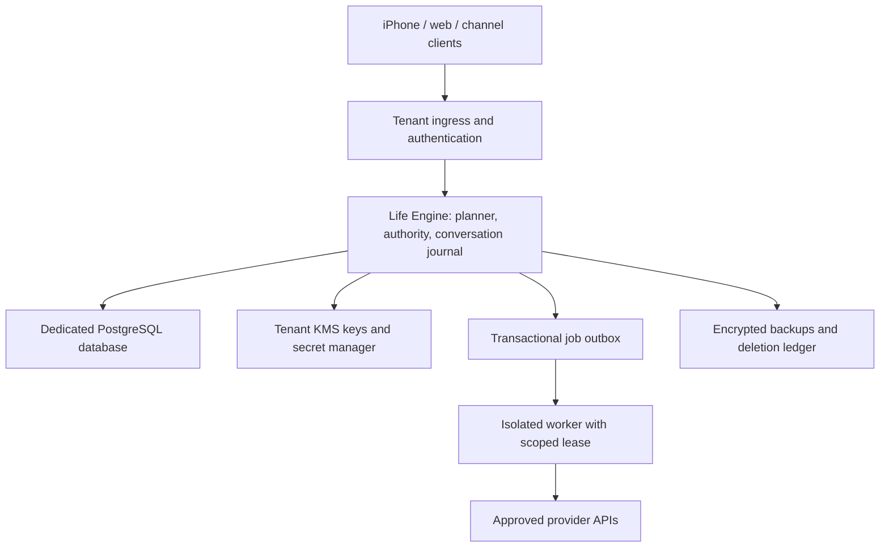

# Production architecture decision — 2026-09-11

Status: implementation target adopted from the owner's review; cloud infrastructure
and migration are not implemented or deployed. This supersedes the Mac-hosted
production assumption in the historical LifeOS plan. The existing Mac relay is a
development integration environment.

## Availability and ownership

LifeOS must work with the owner's Mac powered off. iPhone, future web clients and
OpenClaw channels connect to a cloud Life Engine. It alone owns canonical state,
plans, authority, audit, conversation ordering and provider execution decisions.
OpenClaw and workers remain replaceable, isolated consumers of typed APIs.

## Isolation and persistence decisions

- Start with a dedicated deployment per customer: separate runtime identities,
  network boundary, database instance, encryption keys, secret namespace, job
  queue and backup destination. Shared code/artifacts are permitted; shared
  customer data stores and shared worker credentials are not the initial design.
- A cell has one configured tenant identity. Authenticated account/device membership
  must match it before any repository or provider access. Ignore client-supplied
  tenant routing claims. Support staff access is explicit, time bounded and audited.
- Production persistence targets managed PostgreSQL with redundant storage and
  point-in-time recovery. Local SQLCipher remains the offline development backend.
  Do not mount one SQLCipher file into several cloud replicas.
- Introduce repository/unit-of-work interfaces before migrating the existing
  SQLite-specific queries, triggers, deletion authorization and audit transaction
  behavior. Replacing `KeyProvider` alone is insufficient for cloud readiness.
- Approval consumption, revision checks, canonical mutations, audit and job enqueue
  must commit atomically. Serialize the relevant authority/conversation rows and
  enforce unique replay/idempotency keys in the database. Retry serialization
  failures as whole transactions, never as partial external executions.
- External effects cannot share a database transaction. Persist a pending job,
  execute using a stable operation ID, record the result and reconcile uncertain
  outcomes. Do not blindly retry a provider call after a crash.

These are LifeOS design decisions. PostgreSQL's documented transaction isolation
and retry requirements inform the persistence implementation, rather than implying
that a database switch alone fixes races:
[transaction isolation](https://www.postgresql.org/docs/current/transaction-iso.html).

## Identity, transport and keys

Public ingress uses a managed hostname and valid TLS certificate. Device enrollment
binds an authenticated account to a device signing key; retain request signatures,
expiry, replay protection and revocation. Native pairing and key recovery replace
USB bootstrap. The browser uses account authentication and a separate client
adapter; it must not depend on an installed iPhone client certificate.

If ingress terminates mTLS, the peer identity must reach the engine through an
authenticated internal transport that cannot be spoofed by incoming HTTP headers.
The existing relay extracts the real socket peer; putting it behind an ordinary
reverse proxy without changing and testing that boundary would break this guarantee.
Test forged forwarding headers and cross-tenant tokens explicitly.

Workload identities access a tenant-scoped secret manager/KMS; no static cloud
credentials in environment files. Use independently scoped keys for encryption,
audit integrity and backup wrapping. KMS wrapping keys stay in KMS; unwrapped data
keys exist only in the authorized process for their necessary lifetime. Missing,
denied or lost keys fail closed. Provider tokens stay in the tenant service;
workers receive only short-lived credentials for the authorized operation.

Cloud OAuth callbacks require a separately configured application redirect and
account binding. Do not silently transfer the Mac's installed-app OAuth tokens or
its SQLCipher contents into a cloud deployment. Migrations must explicitly select
data and connections, verify integrity, and produce a rollback record.

## Worker and provider boundaries

Run workers outside the engine process, without access to its database, signing
keys or secret manager role. Enforce egress/site/filesystem allowlists in the
runtime/network boundary, budget/time limits, cancellation and minimized artifact
provenance. Containers alone are not evidence that arbitrary browser/code workers
are isolated. Select and escape-test a sandbox before enabling those capabilities.

Provider interpretation proposes typed changes. Deterministic software validates
them. Model output, channel identity and worker output cannot grant leases or
activate missed-deadline recovery without a trusted application decision.

## Operations, recovery and evidence

Initial engineering targets, not promises: 99.9% monthly API availability, recovery
point at most 15 minutes and restore within four hours. Validate and revise those
targets against measured restores, provider limitations and budget before launch.

Schedule retention and nonce cleanup independently of a personal computer. Maintain
a deletion/revocation ledger that is reapplied before restored data becomes readable.
Verify backup expiration and key retirement together; stale backups must not undo
deletion or resurrect revoked devices. Restore drills run in an isolated cell with
provider execution disabled until state and audit verification finish.

Metrics cover readiness, latency, queue age, rejected authentication, provider errors,
failed reconciliation and restore age. Logs exclude message/audio content, tokens,
raw identities and private keys. Alerting, incident ownership and rollback must be
operational, not just documented.

Cloud release requires captured evidence of Mac-off operation; account/device
enrollment and revocation; cross-tenant denial; replay under concurrent replicas;
crash recovery before and after an external effect; key denial/rotation; backup
restore with deletions; worker isolation; and source-bound deployed artifact identity.

## Implementation sequence and unresolved deployment inputs

The owner's accelerated delivery target and cost preference are tracked in
[one-week delivery](one-week-delivery.md). Google Cloud is the initial proposal
for a managed deployment; account, region, billing ceiling, and provisioning are
still unresolved. The first domain unit-of-work seam now exists locally; this does
not complete the PostgreSQL, authority/outbox, or conversation migration.

1. Preserve the Git baseline, correct planner semantics and track capability maturity.
2. Extract transactional repositories and run the same invariant suite against
   SQLCipher and PostgreSQL. Design the cloud secret provider and enrollment flow.
3. Build one isolated staging cell and move only synthetic test data into it.
4. Demonstrate phone text replies and proposal-only planning with the Mac off;
   then implement calendar lifecycle and consented realtime audio on that path.
5. Add isolated OpenClaw/workers, executive workflows, onboarding and trust controls.
6. Run cloud-focused adversarial review and independent testing before customer use.

Cloud provider/account, region/data residency, domain, spending limit and operator
ownership have not been supplied. These determine the concrete infrastructure and
costs; they do not change the Mac-independent or dedicated-customer requirement.
No paid infrastructure, public endpoint or customer migration has been created.

The greedy planner stays behind its existing deterministic API. Before replacing it,
benchmark a bounded global optimizer using dependency chains, deadlines, travel,
energy and displacement cases. Require feasible output, deterministic tie breaking,
bounded runtime and unchanged explanation/approval semantics. A timeout must retain
a validated feasible proposal, never imply that a greedy failure proves no solution
exists. Optimizer selection and implementation remain open work.
